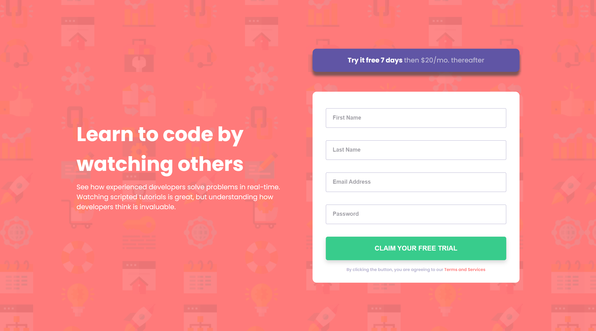

# Frontend Mentor - Intro component with sign up form solution

This is a solution to the [Intro component with sign up form challenge on Frontend Mentor](https://www.frontendmentor.io/challenges/intro-component-with-signup-form-5cf91bd49edda32581d28fd1). Frontend Mentor challenges help you improve your coding skills by building realistic projects.

## Table of contents

- [Overview](#overview)
  - [The challenge](#the-challenge)
  - [Screenshot](#screenshot)
  - [Links](#links)
- [My process](#my-process)
  - [Built with](#built-with)
  - [What I learned](#what-i-learned)
  - [Continued development](#continued-development)
  - [Useful resources](#useful-resources)
- [Author](#author)
- [Acknowledgments](#acknowledgments)

**Note: Delete this note and update the table of contents based on what sections you keep.**

## Overview

### The challenge

Users should be able to:

- View the optimal layout for the site depending on their device's screen size
- See hover states for all interactive elements on the page
- Receive an error message when the `form` is submitted if:
  - Any `input` field is empty. The message for this error should say _"[Field Name] cannot be empty"_
  - The email address is not formatted correctly (i.e. a correct email address should have this structure: `name@host.tld`). The message for this error should say _"Looks like this is not an email"_

### Screenshot



### Links

- [Solution URL](https://your-solution-url.com)
- [Live Site URL](https://gleeful-ganache-43ed79.netlify.app/)

## My process

### Built with

- Semantic HTML5 markup
- BEM
- CSS custom properties
- Flexbox
- Vanilla JS

### What I learned

```js, I didn't expect to use as many forEach scenarios as I did this project, but hey whatever it takes to get me through my learning process!

  inputBox.forEach((box, i) => {
    ....
  })

```

### Continued development

I'm still learning to utilize BEM properly, it's nowhere near perfect, and I often forget how to.
Best thing for me is to chant my little reminder of B - Block, E - Elemet, M - Modifier.
The amount of times I remind myself is unreal, but I am confident sooner than later I will nail it down!

Obviously, CSS is still a big hurdle for me that's mostly due to I'm a sucker for gorgeous Design / UI ,and I want to learn everything about it.

As for JS, I'm actually surprised at myself. It definetly has been a learning process when it comes to it. It's crazy it finally feels like I am understanding. I'm sure it's not perfect, but hey look at my past work you'd be proud too.

### Useful resources

Here's a few links that really helped me get throgh this project!

- [Regex Whitespace](https://stackoverflow.com/questions/7967075/regex-for-not-empty-and-not-whitespace) - Great resource when that helped me figure out regex.

- [Regex Email](https://www.w3resource.com/javascript/form/email-validation.php) - This helped me for the email validation portion.

- [Learning DOM ](https://www.youtube.com/watch?v=VW8kNAous88) - This is an amazing playlist on youtube that has helped me learned what's available through JS DOM.

- [Using forEach](https://www.w3schools.com/jsref/jsref_foreach.asp) - Excellent resource of how to make use of my bff when looping through array's.

## Author

- Frontend Mentor - [@moncadad](https://www.frontendmentor.io/profile/moncadad)
